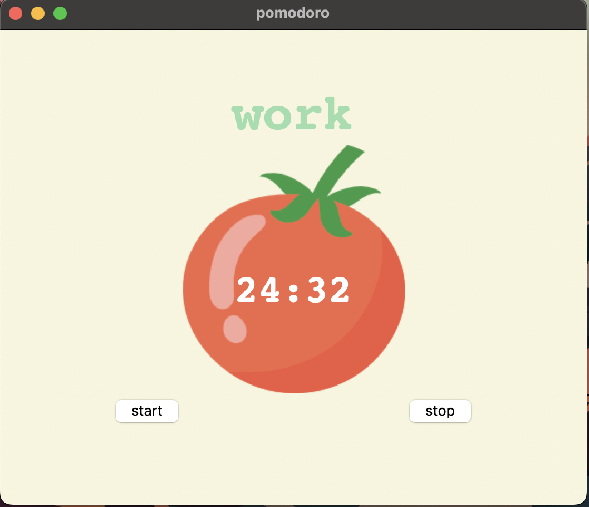

# ⏳ Pomodoro Timer - Tkinter Based Productivity App

Hi! This is a simple and functional **Pomodoro Timer** built using **Python** and **Tkinter**.
It’s a great little tool to help manage your work and break sessions more efficiently using the Pomodoro technique (25 minutes work + short breaks + long breaks).



---

## 🧠 What I Learned / Skills Used

- **Python basics** and how to organize code into functions.
- **Tkinter** for creating GUIs (Graphical User Interfaces).
- Layout management using `.grid()` and making windows **responsive**.
- Using **Canvas**, **Labels**, **Buttons**, and loading **images** in Tkinter.
- **Timer functionality** using `window.after()` for scheduling countdowns.
- Creating reusable components and adding interactivity.

---

## 💡 Features

- Start and stop Pomodoro sessions easily.
- Auto-switch between **work**, **short breaks**, and **long breaks**.
- Visual timer updates every second.
- Checkmarks appear after each completed work session.
- Clean and responsive layout.
- Easy to understand and extend.

---

## 📷 Screenshot

(You can add a screenshot here if you want)

---

## 🚀 How to Run

Make sure you have **Python installed**.

1. Clone or download this repository.
2. Place a `tomato.png` image in the same folder as the `.py` file.
3. Run the script:

```bash
python main.py
```

## 🛠️ Future Ideas
- Add sound alerts at the end of each session.
- Make session durations customizable.
- Add dark mode and other UI themes.